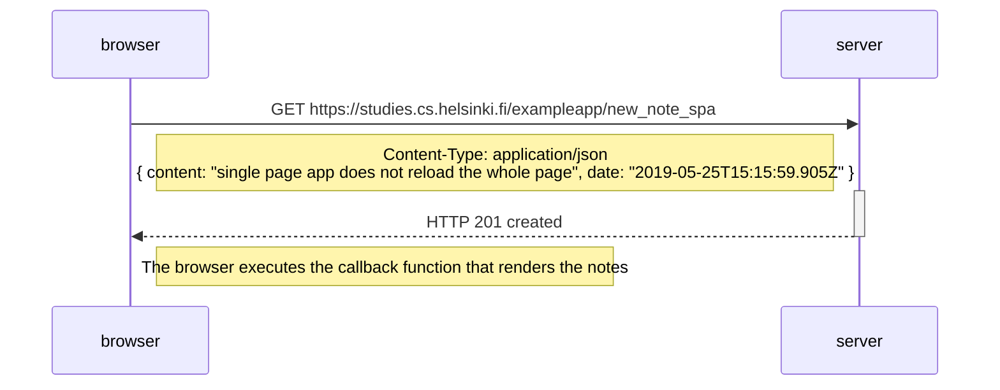

```mermaid
sequenceDiagram
participant browser
participant server

    browser->>server: GET https://studies.cs.helsinki.fi/exampleapp/new_note_spa

    Note right of browser: Content-Type: application/json <br> { content: "single page app does not reload the whole page", date: "2019-05-25T15:15:59.905Z" }

    activate server
    server-->>browser: HTTP 201 created
    deactivate server

    Note right of browser: The browser executes the callback function that renders the notes
```
